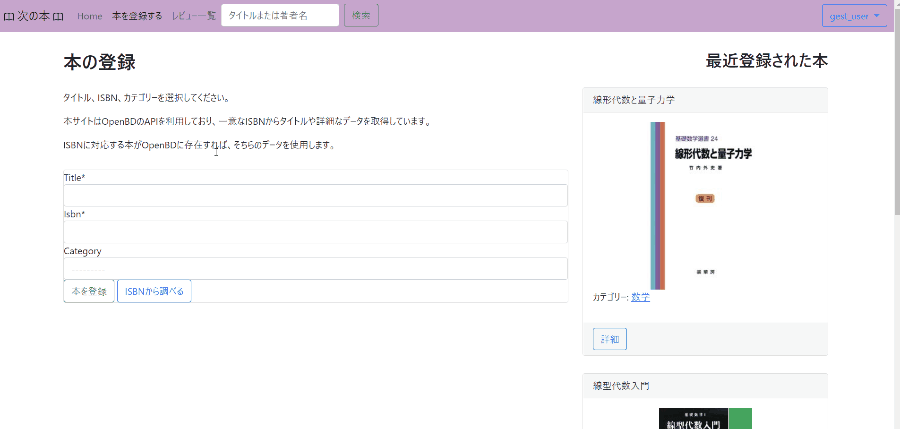
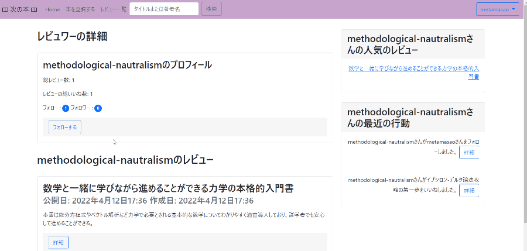
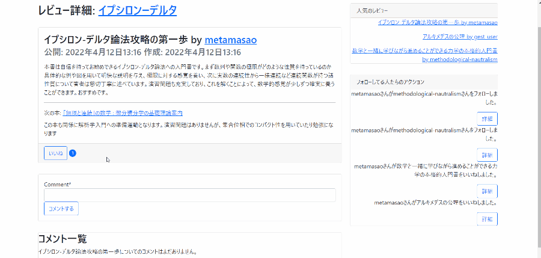
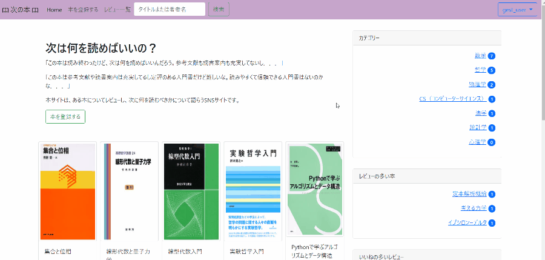

# 簡単な自己紹介と書評SNS作成について

1. [はじめに](#はじめに)
2. [自己紹介](#自己紹介)
3. [書評SNSについて](#書評snsについて)
    1. [設計思想について](#設計思想について)
    2. [なぜ書評snsを作ったか](#なぜ書評snsを作ったか)
    3. [アプリケーションの概要](#アプリケーションの概要)
    4. [各アプリの機能や工夫したところ](#各アプリの機能や工夫したところ)
4. [反省、これまで勉強してきたこと、今後勉強したいこと](#反省これまで勉強してきたこと今後勉強したいこと)

## はじめに　
本稿ではまず私は何に興味があるのか、勉強する際にどういったことに注意を払ってきたのかといった簡単な自己紹介を行います。次に私が作成した書評SNSについて、設計思想からなぜこのようなアプリケーションを作ったのかという動機、基本的機能や目的を達成するために工夫した点、どのような書籍や記事に基づいて作成したのか説明します。最後に、今回作ったアプリケーションについての反省や、これまで勉強したこと、今後勉強したいことについて述べます。

## 自己紹介 
私は統計的学習に当初興味があり勉強していましたが、webに関する基本的知識があまりになさすぎると思い、去年7月頃から勉強し始めたところ、こちらのほうが面白くやりがいを感じるようになり、現在web系エンジニアになるべく独学で勉強しています（「独学」という言葉は巨人の方に乗ることを否定するきらいがあるのであまり好きではありませんが、他の方との差異を強調する可能性があるので使いました）。

また勉強する際には、和書に限定せず洋書も含めて信頼できそうな書籍を探し、それに依拠するまたは公式ドキュメントに基づいて学習を進め、ベストプラクティスに従うようにしました。積極的にDjangoやサードパーティーのコードも見ています。ネットの記事を参考にすることもありますが、その場合もできる限り信頼できる書籍によって参照されているような記事を参考にしました。というのも、できる限り信頼できる情報を得ることに注意を払うことで、品質及び今後の成長の可能性を示したかったからです。具体的にどのような書籍や記事を参考にしたのかは次節以降に記します。以下、一応プログラミング以外について簡単に私が興味のあることや資格を書いています。

- 英検準1級
- 哲学（現代形而上学や倫理学などなど）、数学、物理学、統計学

## 書評SNSについて

### 設計思想について
Test以外ではできる限りDRYに従い、ModelやViewを作るときはFat ModelやThin View(Skinny Controller)の方針に従いロジックなどはViewではなくできる限りModel(Managerも含む)に記述しました。また、伝統的なFat Model(属性やメソッドが単純にたくさん定義されたModel)にするのではなく、抽象モデルのMix-inクラスを作成しそれを継承することで、DRYを効率よく達成しようとしました。このようなMix-inクラスうち、とりわけ汎用性が高いのはcoreアプリに、各アプリに依存性が高いMix-inクラスは各アプリで書くようにしました。

テストではDRYの方針に従わず同じようなコードを何度も書くようにしました。これはテストコードそれ自体がテストの必要があるコードになるのを防ぐためです。さらに、test.Clientではmiddlewareやurlsへの依存性が高く、そのためviewを直接検証できない、テストが遅くなるという問題があるので、できる限りtest.RequestFactoryを使うようにしました。 

### なぜ書評SNSを作ったか
私だけではないと思いますが、次のような問題に頭を悩ませるひとがいると思います。「ある分野の入門書を探してるけど、何が最適なテキストなのかわからない」「とりあえず入門書を1冊読んだけど、次に何を読めばいいのかわからない」。このような困難を少しでも克服できるようなSNSを作りたい。このような動機から本アプリケーションを作成しました。

### アプリケーションの概要

本アプリケーションでは、会員登録後に、本の登録（OpenBDのAPIから本の情報を取得）、ある本についてのレビューの作成、ユーザーフォローと「いいね」（Axiosを用いた非同期通信）ができ、フォローしたユーザの活動（誰をフォローしたか、どのレビューをいいねしたか）も確認できます。レビューを作成する場合には次の本を指定し推薦文を書くことが必須となっており、こうすることで次に何を読めばいいのかという問題を解消しようと努めました。

開発環境の構築に関しては、本番環境でのOSが異なることで生じる不具合や異なるデータベースを用いることで生じるマイグレーションファイルの不具合に対処するためにDockerを用いました。Herokuにてデプロイしましたが、コードを公開しつつアプリケーションを運用するのはセキュリティ上のリスクを犯すことになるのでストップし、代わりにgifをここに貼っています。

Test coverage: 98%

本の登録

ユーザーフォロー

いいね

フォローしてるユーザーの活動

#### 使用技術

##### Frontend
- Bootstrap
- Axios

##### Backend
- Django

##### PaaS
- Heroku

##### SaaS
- Sentry

### 各アプリの機能や工夫したところ

#### Account

- 会員登録
- プロフィール編集
- ユーザーフォロー(axiosを用いた非同期通信)
- ユーザー追跡機能(フォローやいいねを記録する)
- superuser以外のアカウントが管理画面(admin)にリクエストを送ると、middlewareがviewを呼ぶ前に403(権限がない)を返すようにしてます。
- とりわけ工夫したのは、ユーザーの活動を記録するActionModelとActionManagerです。「フォロー」はCustomUserモデル、「いいね」はReviewモデルと異なるタイプのモデルなので、GenericForeignKeyを使うことも可能でしたが("Django 3 by Exmaple"では実際にそのように実装されていましたが)、"Two Scoops of Django"の著者によると、クエリのスピードが低下すること、データが壊れる可能性があることから、そのように実装することはせず、それぞれのインスタンスのURLとそれに対応した内容を格納することで、GenericForeignKeyと同じようにふるまうActionモデルを作成しました。 [^1] また、具体的な活動を記録するロジックをActionManagerにて定義し、FollowManagerとLikeManagerそれぞれでインスタンスを生成するときにActionManagerのメソッドを呼び出すようにしました。こうすることで、Thin Viewを実現しました。
- ユーザーフォローする場合にAjaxを使うため、HTTPヘッダーフィールドのx-requested-withがXMLHttpRequestではないリクエストや、csrfトークンなしでのリクエストに対してきちんと対処できてるかどうか主にテストでは検証しました。

[^1]: "The idea of a generic relations is that we are binding one table to another by way of an unconstrained foreign key (GenericForeignKey). Using it is akin to using a NoSQL datastore that lacks foreign key constraints as the basis for projects that could really use foreign key constraints. This causes the following: ​Reduction in speed of queries due to lack of indexing between models. ​Danger of data corruption as a table can refer to another against a non-existent record....Over time, we’ve found that we can build favorites, ratings, voting, messages, and tagging apps built off ForeignKey and ManyToMany field. For a little more development work, by avoiding the use of GenericForeignKey we get the benefit of speed and integrity."
Greenfeld, Daniel Roy; Greenfeld, Audrey Roy. Two Scoops of Django 1.11: Best Practices for the Django Web Framework (p.77). Two Scoops Press. Kindle 版. 

#### Book

- 本の登録(簡単な情報についてOpenBDのAPIを利用)
- 本の詳細な情報(axiosを用いてOpenBDより非同期通信で取得)
- 書名や著者名に基づく検索
- カテゴリーによる分類
- ページネーション
- 書籍の簡単な情報はOpenBDより取得していますが、何が問題があった場合(レスポンスのステータスコードが200番台以外の場合)にはSentryでログを拾い、メールにて通知するようにしています。本当はSlackに通知したいのですが。
- テストするときにはAPIを利用するわけにはいかないので、unittestのモックオブジェクトを使いました。

#### core

- ここでDRYやFat Model, Thin View(Skinny Controller)の方針を満たすための特に汎用性の高いコードを書いています。セキュリティ上の観点から単調増加キーではなくUUIDフィールドを主キーとして用いたUUIDModel、UUIDModelベースのUUIDURLModel、PublishModel、SearchResultMixinなどなどがあります。

#### Review

- レビューのCRUD機能
- レビューへのコメント、いいね機能
- ページネーション
- 特定の著者や本に紐づけられたレビュー一覧はここにReviewDetailMixinを作り、ListViewにそれを継承することで繰り返しを避けるようにしました。 

#### 本アプリケーションを構築する際に参考にした書籍や記事

##### 書籍

- [横瀬　明仁、『現場で使えるDJANGOの教科書　<実践編>』](https://booth.pm/ja/items/1030026)
- [Vincent, Williams S. , "Django for Beginners"](https://djangoforbeginners.com/)
- [Vincent, Williams S. , "Django for Professionals"](https://djangoforprofessionals.com/)
- [Mele, Antonio, "Django 3 By Example"](https://www.packtpub.com/product/django-3-by-example-third-edition/9781838981952)
- [Greenfield, Daniel Roy, and Greenfield, Audrey Roy, "Two Scoops of Django"](https://www.feldroy.com/books/two-scoops-of-django-3-x)

##### ネット上の記事

- [Django Model Behaviors](https://blog.kevinastone.com/django-model-behaviors)
- [Testing Django Views Without Using The Test Client](https://www.ianlewis.org/en/testing-django-views-without-using-test-client)

## 反省、これまで勉強してきたこと、今後勉強したいこと

### 反省
以下、いくつかコードとアプリケーションの機能について反省点があります。
- Javascriptのコードに関してはできていません。今後はこちらもできるようにしたいです。
- またDjangoのコードに関しても、followやlikeは同じようなロジックと流れになっているので、それを抽象化してMix-inクラスを作ることで繰り返しを避けるべきでした。
- レビュー作成時に次に読むべき本の指定や推薦文を必須としました。しかし、これはユーザーにとって大きな負担になっている可能性があり、だとすれば、利用者を増やすことが難しくなり、その結果「次に何の本を読むべきかわからない」という問題を解決するプラットフォームを提供することが難しくなります。そもそも、利用者が少なくごく限られた人によって利用されるのであれば、このようなSNSは必要がなく、玉石混交の入門書の中から適切な本を選べばいいからです。そしてそれが難しいからこそ、このようなSNSで少しでも円滑に入門書などを選べる機会を提供したかったのです。従って、そのような目的は十分には達成できなかったと考えています。今後、もう少し考えたいと思います。

### 勉強してきたこと

#### webに関する基本的な知識とフロントエンド
webに関する基本的なことについては

- [小林恭平、坂本陽著、佐々木拓郎監修　『この一冊で全部わかるWeb技術の基本』　SB Creative](https://www.sbcr.jp/product/4797388817/)

を読み勉強しました。

HTML, CSS, Javascriptの書籍に関しては

- [たにぐちまこと、『HTML&CSS, JavaScriptのきほんのきほん』、マイナビ出版](https://book.mynavi.jp/ec/products/detail/id=65861)

を読みました。変数宣言する際にvarを使っていることが気になりますが、最後にはJQueryやVueなどのライブラリも紹介しており勉強になりました(ちなみに、本アプリケーションではデザインに関しては基本的にBootstrapに依拠しており、非同期通信のためだけに読み込みの遅いJQueryを使うのはデメリットが大きいと思い、axiosを使いました)。

またMdnのドキュメントも重宝しています。Mdnの"Learn Web Development"は、webの基本的な仕組みや、HTML, CSS, Javascript, npmによるJavascriptライブラリのパッケージ管理などなど勉強する際に役に立ちました。とりあえず、webの基本的な事柄やフロントエンドについてわからないことがあれば、ここで調べるようにしています。

React.jsに関しては公式ドキュメントのMain Conceptを一通り読んだ程度です。

#### バックエンド

英語圏ではDjangoは日本に比べて人気があり、使用している人口も多いことから良書も多いだろうと思い、なるべく早く洋書で定評のありそうな本を探しました。以下、参考になった本です。

- [横瀬明仁、『現場で使えるDJANGOの教科書　<基本編>』](https://booth.pm/ja/items/1308742)

この本はチュートリアル形式でアプリを作るような入門書ではなく、Djangoを構成するview, model, middlewareなどについて基本的な知識を解説する本で、勉強になりました。また、参照している本や記事などにもきちんと言及しており、ここから次に何を読むか決めました。次に読んだのは

- [Vincent, Williams S. , "Django for Beginners"](https://djangoforbeginners.com/)
- [Vincent, Williams S. , "Django for Professionals"](https://djangoforprofessionals.com/)

です。どちらもテストについて充実しており、ベストプラクティスを強調していることが良かったです。前者は、簡単なアプリケーションから始めてもうちょっと本格的なアプリケーション構築までしますが、各アプリケーションでHerokuにデプロイすることで、デプロイメントする際の心理的コストを取り除く点が、後者は、開発環境と本番環境での違いを確認したうえでのDockerの導入、信頼できるThird Partyの積極活用、セキュリティの観点から気を付けるべきことなどがプロの視点から説明されている点がとりわけ良かったです。また著者のブログも参考にしています。

- [Mele, Antonio, "Django 3 By Example"](https://www.packtpub.com/product/django-3-by-example-third-edition/9781838981952)

この本はユーザーフォローなどの多対多関係の構築やそれを非同期通信を用いて構築する本格的なアプリケーションを作りたいと思い購入しました。しかし、ベストプラクティスに反するなど著者の癖が強い、他の文献への参照がないこと、第6章まで読み以降は読んでいません。それでも勉強になる点がありました。

次の本はとてもとても勉強になりました。

- [Greenfield, Daniel Roy, and Greenfield, Audrey Roy, "Two Scoops of Django"](https://www.feldroy.com/books/two-scoops-of-django-3-x)

私が読んだのは1.11なので少し古いですが、参照してる本や記事がとても多いことに加えて、設計思想といった抽象的観点からどのようにアプリケーションを構築すべきかだけではなく、Djangoの各機能が実践的観点から幅広く紹介されており、本当に勉強になりました。

また次の本も写経しながら読みましたが、

- [Vincent, Williams S. , "Django for APIs"](https://djangoforapis.com/)

ちょっと前なので少し忘れているところもあるとおもいます。

他には

- [Bill Lubanovic　著、斎藤 康毅　監訳、長尾 高弘　訳 『入門Python3』](https://www.oreilly.co.jp/books/9784873117386/)
- [Paul Barry　著、嶋田 健志　監訳、木下 哲也　訳 『Head First Python 第2版
――頭とからだで覚えるPythonの基本』](https://www.oreilly.co.jp/books/9784873118291/)

などを読みました。前者は9章まで読み、10章以降は適宜参照する形で使用し、後者はFlaskで簡単なアプリケーションを作ることでpythonによるwebアプリケーション開発の基本的な事柄を学びました。

#### 今後勉強したいこと

諸事情により、今回のアプリケーション作成で以下のようなことができませんでした。

- AWSのようなIaaSを利用してのデプロイ
- Amazon S3などのクラウドストレージやCloudFrontなどのCDNを利用した静的コンテンツ及びユーザアップロードコンテンツの取り扱い(Herokuでも同じサーバーでユーザーアップロードコンテンツを取り扱うことはできますが、これはセキュリティリスクが大きいのでしていません。例えば、本当はhtmlファイルなのにヘッダーにpng headerがあれば、Pillowを用いたDjangoの検証を画像ファイルとしてパスしてしまい、そのファイルが悪質なスクリプトを含んでいる場合など。この問題はAmazon S3のようなクラウドストレージを利用して、HTTPヘッダーフィールドのCSPを有効にすれば対処できますが)。

今後はこういったこともAWSの入門書やLinuxコマンド入門書を読んで取り組んでいきたいと思っています。以下は、個人的な関心からです。

今回のアプリケーション作成するにあたって、クラスの多重継承をMix-inに限って活用しておりこれ自体は問題はないと思うのですが、そもそも一般的にどのようなクラス継承が望ましいのか、もっと一般的な観点からどのようにクラスを作り利用するのが望ましいのか、こういった点が気になるので次のデザインパターン本を読んで勉強したいと思います。

- [Mark Summerfield　著、斎藤 康毅　訳 『実践Python3』](https://www.oreilly.co.jp/books/9784873117393/)

そもそもプログラムはなぜ動くのか、ネットワークはなぜつながるのかもっと低レベルな観点から理解したいので、そのような欲求を満たしてくれる本

- [矢沢 久雄 著『プログラムはなぜ動くのか 第３版　知っておきたいプログラミングの基礎知識』](https://www.nikkeibp.co.jp/atclpubmkt/book/21/S00190/)

- [戸根　勤著 日経NETWORK監修 著 『ネットワークはなぜつながるのか　第２版
知っておきたいTCP/IP、LAN、光ファイバの基礎知識』](https://www.nikkeibp.co.jp/atclpubmkt/book/07/P83110/)

できる限りセキュリティ面に注意したのですがちゃんと1冊読み込んだわけではないのでいわゆる徳丸本

- [徳丸浩　『体系的に学ぶ 安全なWebアプリケーションの作り方 第2版』](https://www.sbcr.jp/product/4797393163/)

現在この本を読み始めたところです

- [辻真吾･著　下平英寿･編 『Pythonで学ぶアルゴリズムとデータ構造』](https://www.kspub.co.jp/book/detail/5178034.html)

今後はFlaskやLaravel(php), Rails(ruby), Gin(go)など他のフレームワークや言語にも果敢に挑みたいと思います。訂正すべき点などがありましたら是非教えてください。長々と失礼しました。よろしくお願いします。
